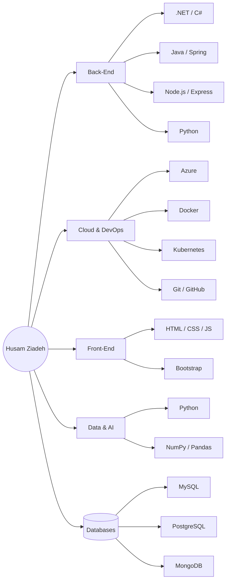
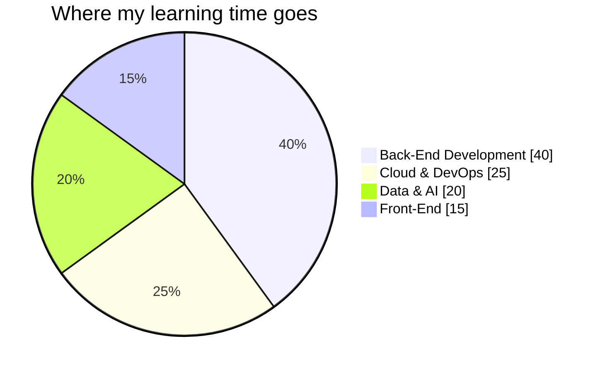
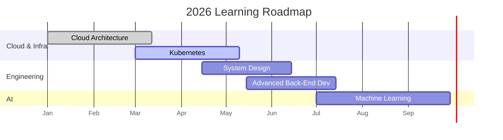

# Hello World 👋, I'm Husam Ziadeh

  
  
  

---

## 🧾 Quick Facts

| | |
|---|---|
| 🎓 **Education** | Computer Science Student |
| 💼 **Focus** | Back-End & Cloud Engineering |
| ☁️ **Cloud** | Microsoft Azure |
| 🤖 **Interests** | Machine Learning & AI, System Design |
| 🌍 **Status** | Open to internships and collaboration |
| 📫 **Reach me** | [LinkedIn](https://www.linkedin.com/in/your-linkedin-handle) · [Email](mailto:your.email@example.com) |

---

## 🗺️ Tech Stack Overview

---

## 📊 Skill Proficiency

**Programming Languages**

**Cloud & DevOps**

> 💡 These percentages are self-assessed — adjust the numbers in the URLs (`/85/`) to reflect your actual comfort level with each tool.

---

## 🥧 Focus Areas

---

## 🗓️ Learning Roadmap

---

## 🏆 Certifications

| Certification | Issuer | Status |
|---|---|---|
| Microsoft Azure Fundamentals (AZ-900) | Microsoft | ✅ Completed |

---

## 💻 Technologies I Work With

**Programming Languages**

**Back-End Development**

**Cloud & DevOps**

**Front-End Development**

**Data Science & AI**

**Databases**

---

## 🔥 Featured Projects

| Project | Description | Tech Stack |
|---|---|---|
| 🌦️ [Weather App](#) | Mobile app providing real-time weather info, forecasts, and conditions through a clean UI. | HTML, CSS, JavaScript, API Integration |
| 🏫 [Programming School Website](#) | Responsive website for a programming school showcasing courses and services. | HTML, CSS, JavaScript, Bootstrap |
| 💰 [Salary Management System](#) | Assembly Language project calculating salaries, allowances, deductions, and net income. | Assembly Language, Irvine32 |

> 💡 Replace the `#` links with your real repo URLs, e.g. `https://github.com/HusamZiadeh/weather-app`

---

## 📊 GitHub Analytics

  
  

  

  

---

## 📫 Connect with Me

  
  &nbsp;
  

> 💡 Swap in your real LinkedIn URL and email above.

---

<i>Thanks for stopping by — feel free to explore my repositories and reach out! ⭐</i>

